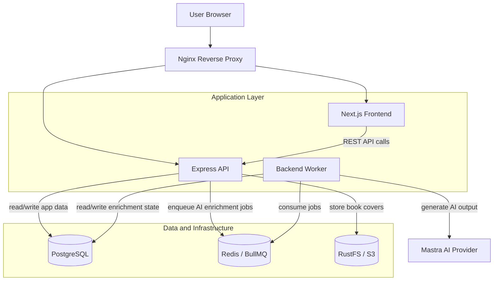

# Book Review Platform

A full-stack book review app for browsing books, publishing reviews, uploading cover images, and enriching review content with AI-generated summaries, sentiment scores, and tags.

The app is designed around a responsive submission flow: reviews are saved immediately, while slower AI enrichment work runs asynchronously in the background.

## Tech Stack

- **Frontend:** Next.js App Router, React, TypeScript, Tailwind CSS, React Hook Form
- **Backend API:** Express, TypeScript, PostgreSQL, Zod-style env diagnostics, request logging
- **Background jobs:** Redis, BullMQ, dedicated backend worker process
- **AI enrichment:** Mastra AI integration for review summary, sentiment score, and tags
- **Storage:** RustFS / S3-compatible object storage for book covers
- **Deployment:** Docker Compose, Docker Hub, GitHub Actions, VPS, Nginx reverse proxy

## System Architecture

## Review Enrichment Flow

1. User submits a review from the frontend.
2. The API validates the book and saves the review with `ai_enrichment_status = pending`.
3. The API enqueues a BullMQ job in Redis and returns `201` immediately.
4. The frontend redirects back to the book detail page and shows a pending AI state.
5. The worker consumes the job, marks the review as `processing`, and calls the AI enrichment service.
6. The worker stores `summary`, `sentiment_score`, `tags`, and marks the review as `completed`.
7. The frontend polls the first review page briefly and updates the review card when enrichment finishes.

If Redis enqueueing fails after the review is saved, the review is preserved and marked with a failed AI state so user content is not lost.

## Runtime Services

- `frontend`: Next.js app served to users.
- `backend`: Express API for auth, books, reviews, search, uploads, and queue producers.
- `backend-worker`: Separate process that consumes Redis/BullMQ jobs and performs AI enrichment.
- `db`: PostgreSQL database for users, books, reviews, and enrichment state.
- `redis`: Queue backend for asynchronous review enrichment jobs.
- `rustfs`: S3-compatible local object storage for uploaded book covers.
- `rustfs-bucket-init`: Local helper that creates the development bucket.

## Repository Guide

- `frontend/`: Next.js application and UI components.
- `backend/src/controllers/`: HTTP request handlers.
- `backend/src/models/`: PostgreSQL query layer.
- `backend/src/services/`: domain services, AI enrichment, logging.
- `backend/src/queues/`: Redis/BullMQ queue setup.
- `backend/src/worker.ts`: background worker entrypoint.
- `backend/db/schema.sql`: base database schema.
- `docker-compose.yml`: full local Docker stack for onboarding/evaluation.
- `docker-compose.infra.yml`: dependency-only stack for maintainers.
- `docker-compose.production.yml`: image-only VPS runtime stack.

## Development Docs

- Maintainers editing code day to day: [docs/maintainer-development.md](docs/maintainer-development.md)
- Developers who want to run all services locally with Docker: [docs/local-docker-setup.md](docs/local-docker-setup.md)

## Production Deployment

Production uses prebuilt Docker Hub images and `docker-compose.production.yml`. The VPS does not need a full repository checkout; GitHub Actions builds and pushes images, then deploys with the production compose file and server-local `.env.production`.

Images built by CI:

- `${DOCKER_USERNAME}/book-review-backend`
- `${DOCKER_USERNAME}/book-review-frontend`

The VPS runtime includes PostgreSQL, Redis, the backend API, the backend worker, and the frontend. Nginx terminates TLS and routes `/` to the frontend and `/api/` to the backend.

## Environment Files

- `.env.example`: local development defaults.
- `.env.production.example`: production template for the VPS `.env.production`.

Keep real secrets out of git.
